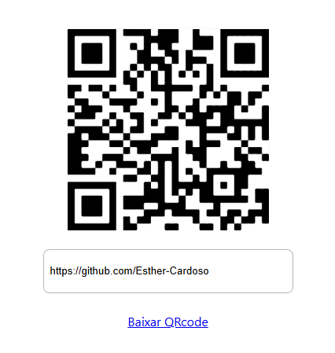

<h1 align="center">QRCode</h1>

Esse é um projeto de gerar qrcode, feito com react.

  

<a href="#objetivo">Objetivo</a> • <a href="#tecnologias">Tecnologias</a> • <a href="#autor">Autor</a>

<a href="https://geradorqrcode-react.netlify.app//">Clique aqui para abrir o site</a>

<h2 id="objetivo">Objetivo</h2>

O objetivo desse projeto foi colocar em prática meus conhecimento de react. Aqui eu trabalhei com useState e bibliotecas externas, para fazer as funcionalidades do qrcode.

<h2 id="tecnologias">🛠 Tecnologias</h2>
As seguintes ferramentas foram usadas na construção do projeto:

- HTML
- CSS
- JavaScript
- React

## Autor

<a href="https://www.instagram.com/_esther_cardoso/">
 
  
 <b>Esther Cardoso</b></a>

Feito por Esther Cardoso 👋🏽 Entre em contato!

